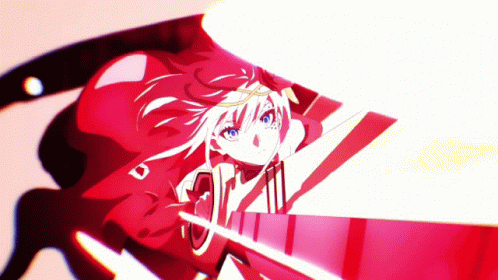

<p align="center">
  
</p>

<p align="center">
  
</p>

<div align="center">
  
**Bringing Ideas to Life Through Code, Creativity & Innovation** ✨

</div>

---

## 👤 About Me

<div align="center">
  <table>
    <tr>
      <td width="60%">
        I'm a passionate <b>Full-Stack Developer</b> and <b>Creative Professional</b> based in Indonesia, dedicated to building beautiful, functional applications that solve real-world problems. With expertise in mobile development, web technologies, and creative multimedia, I combine technical skills with artistic vision to deliver exceptional digital experiences.

- 🎯 **Focus**: Mobile & Web Application Development with cutting-edge technologies
- 🌱 **Currently Learning**: Advanced Flutter patterns, Backend architecture, AR/VR development
- 💡 **Passionate About**: Database optimization, Interactive multimedia, Augmented Reality
- 🎨 **Creative Skills**: UI/UX Design, Video editing, 3D modeling, Graphic design
- 🚀 **Mission**: Build impactful applications that make a difference
- 💪 **Philosophy**: Clean code, continuous learning, and user-centric design
      </td>
      <td width="40%" align="center">
        
      </td>
    </tr>
  </table>
</div>

---

## 🛠️ Technical Skills

### 💻 Programming Languages
<p align="center">
  
  
  
  
  
  
  
</p>

### 📱 Mobile Development
<p align="center">
  
  
</p>

### 🗄️ Database & Backend
<p align="center">
  
  
  
</p>

### 🎨 Tools & Platforms
<p align="center">
  
  
  
  
  
  
</p>

### 🎬 Creative & Multimedia
<p align="center">
  
  
  
  
</p>

---

## 📈 GitHub Statistics

<p align="center">
  
</p>

<p align="center">
  
  
</p>

---

## 🔥 Contribution Activity

<p align="center">
  
</p>

---

## 🎯 What I'm Looking For

<div align="center">

| 💼 Opportunities | 🤝 Collaboration | 🎓 Growth |
|:---:|:---:|:---:|
| **Mobile Development** | **Open Source** | **Web Technologies** |
| **Web Applications** | **Team Projects** | **Backend Systems** |
| **AR/Interactive** | **Freelance Work** | **AR & 3D Graphics** |
| **Internship Programs** | **Knowledge Sharing** | **Leadership Skills** |

</div>

---

## 🌍 Connect With Me

<p align="center">
  <a href="https://linktr.ee/Nxta_" target="_blank">
    
  </a>
  <a href="https://github.com/Abduldinata" target="_blank">
    
  </a>
  <a href="mailto:your.email@example.com" target="_blank">
    
  </a>
</p>

---

<div align="center">

### 🌟 Thanks for Visiting! 🌟

<p align="center">
  
</p>

*Feel free to explore my repositories and connect with me for exciting opportunities!*

```
╔═══════════════════════════════════════╗
║   Let's Build Something Amazing! ✨   ║
╚═══════════════════════════════════════╝
```


</div>
