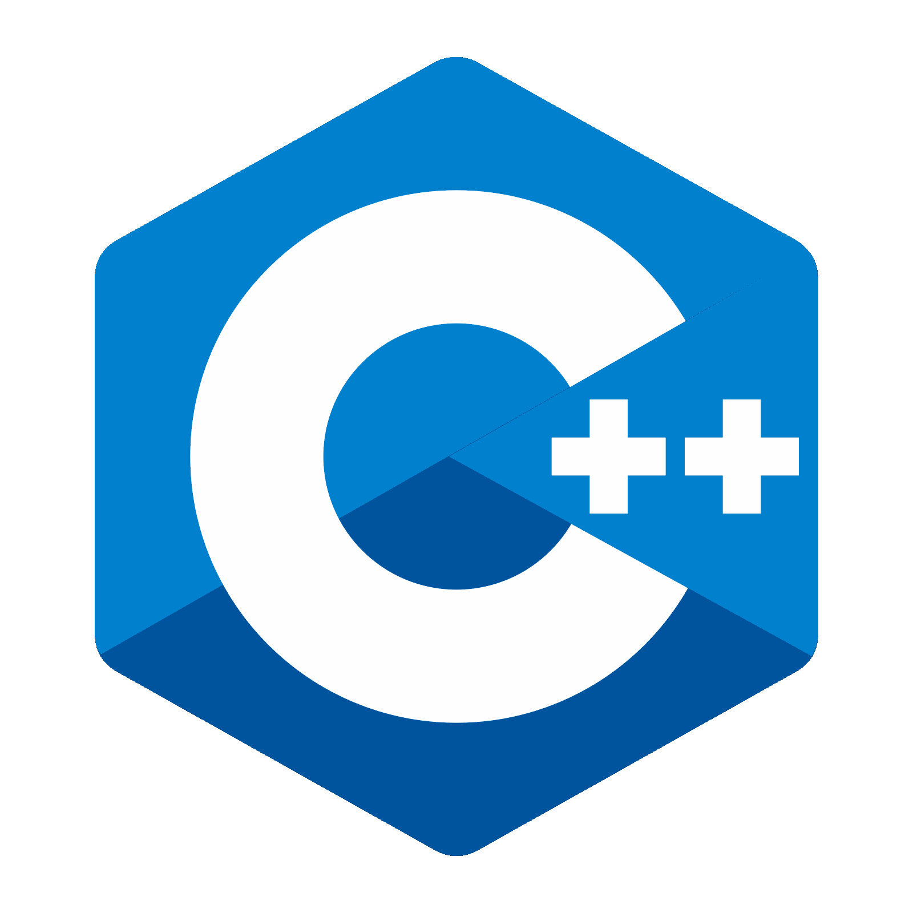
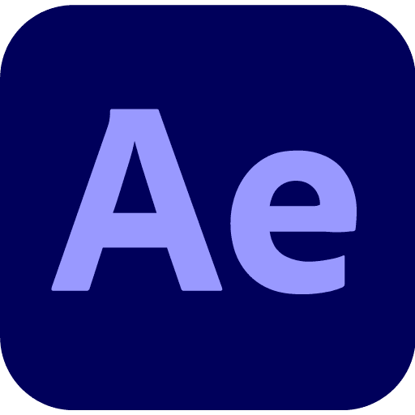
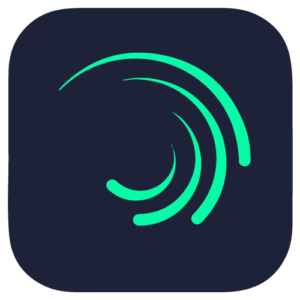
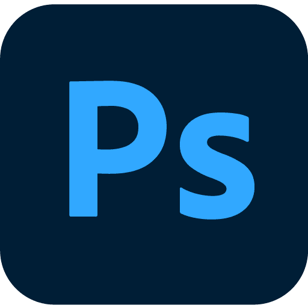
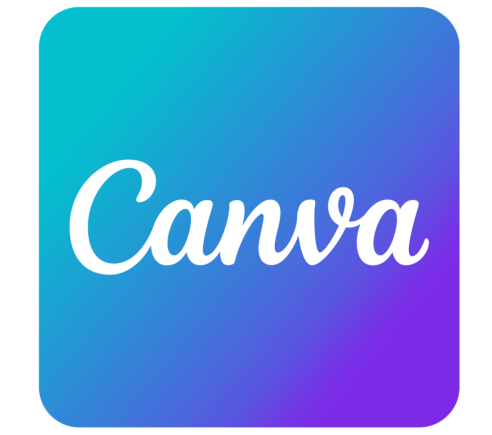

  

  

---

## 🧠 About Me

Multi-disciplinary developer with a focus on building robust mobile and web ecosystems.  
I bridge the gap between **technical logic** and **visual aesthetics**, specializing in cross-platform development while integrating 3D and interactive elements into modern software.

---

## 🛠️ Tech & Creative Ecosystem

### 💻 Development & Systems

   &nbsp;
   &nbsp;
   &nbsp;
   &nbsp;
   &nbsp;
   &nbsp;
   &nbsp;
   &nbsp;
  

### 🎨 Creative Suite & Interactive

   &nbsp;
   &nbsp;
   &nbsp;
   &nbsp;
   &nbsp;
   &nbsp;
   &nbsp;
  

---

## 🌐 Connect & Collaborate

  
  
  

  
  
  
  

---

## 📈 Contribution Graph

  

---

  <i>Let's build something impactful together.</i> 🚀

